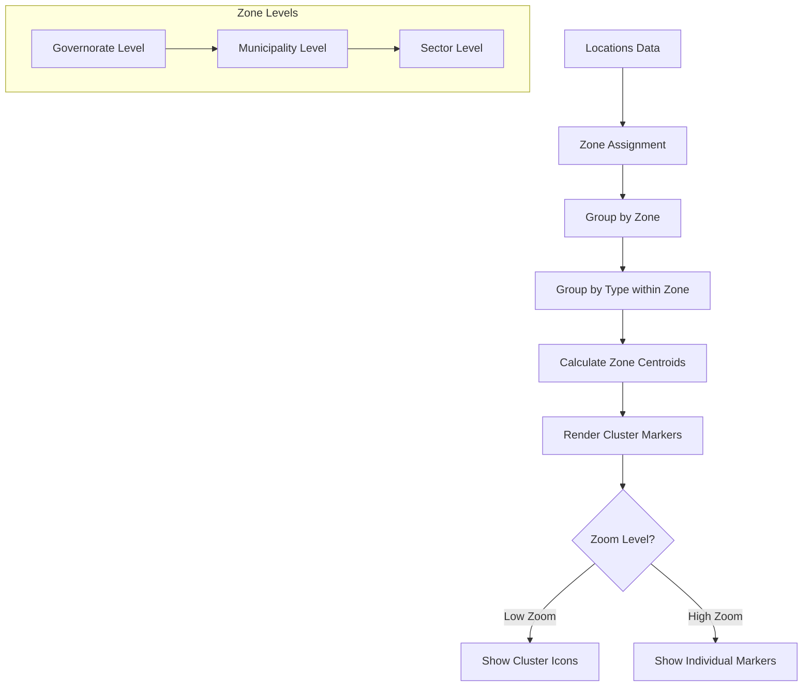

# Zone-Based Marker Clustering Implementation Plan

## Overview
Implement zone-based marker clustering where markers (pickup points, driving schools, exam centers) are grouped by:
1. **Zone level**: Governorate → Municipality → Sector
2. **Location type**: Within each zone, markers cluster separately by type

This is a **custom aggregation approach** (not using `react-leaflet-markercluster`) because:
- Standard clustering groups by geographic proximity
- We need grouping by zone boundaries + type
- More control over cluster positioning (at zone centroids)
- Simpler implementation without extra dependencies

---

## Architecture



---

## Data Flow

### 1. Zone Assignment
Each location needs to know which zones it belongs to:
```javascript
location = {
  id: 1,
  type: 'pickup_point',
  latitude: 36.8,
  longitude: 10.18,
  zoneIds: {
    governorate: '11',    // Tunis
    municipality: '1101', // Tunis Centre
    sector: '110101'      // Specific sector
  }
}
```

### 2. Grouping Logic
```javascript
// At governorate level
groupedByZone = {
  '11': {  // Tunis governorate
    pickup_point: [loc1, loc2, ...],
    driving_school: [loc3, ...],
    exam_center: [loc4, ...]
  },
  '12': {  // Ariana governorate
    pickup_point: [loc5, ...],
    ...
  }
}
```

### 3. Cluster Marker Rendering
For each zone + type combination, render a cluster marker at the zone's centroid:
- Icon shows type emoji + count
- Click zooms to that zone
- Hover shows zone name + breakdown

---

## Implementation Steps

### Step 1: Enhance Location Data with Zone IDs
**File**: `src/utils/api.js` or backend

Currently, locations don't have zone IDs. We need to:
- Option A: Backend returns `gov_id`, `mun_uid`, `sec_uid` for each location
- Option B: Frontend computes zone assignment using turf.js point-in-polygon

**Recommended**: Option A (backend) for performance, but Option B works for now.

### Step 2: Create Zone-Aware Clustering Hook
**File**: `src/hooks/useZoneClustering.js` (new)

```javascript
export function useZoneClustering(locations, currentLevel, zonesGeoJSON) {
  // 1. Assign each location to zones (if not already done)
  // 2. Group locations by current level's zone IDs
  // 3. Within each zone, group by location type
  // 4. Calculate zone centroids from GeoJSON
  // 5. Return cluster data structure
}
```

### Step 3: Create Cluster Marker Component
**File**: `src/components/ZoneClusterMarker.jsx` (new)

Renders a cluster marker with:
- Type icon (📍, 🏫, 📝)
- Count badge
- Zone name tooltip
- Click handler to zoom/select zone

### Step 4: Modify TunisiaMap Component
**File**: `src/components/TunisiaMap.jsx`

Replace `ZoomAwareMarkers` with new clustering logic:

```javascript
// New imports
import { useZoneClustering } from '../hooks/useZoneClustering'
import { ZoneClusterMarkers } from './ZoneClusterMarkers'

// Inside TunisiaMap component
const clusters = useZoneClustering(
  filteredLocations, 
  currentLevel, 
  filteredFeatures  // current GeoJSON
)

// In render
<ZoneClusterMarkers 
  clusters={clusters}
  onClusterClick={handleClusterClick}
  zoom={zoom}
/>
```

### Step 5: Handle Zoom-Based Breakdown
Add zoom threshold logic:
- Zoom < 10: Show only cluster icons
- Zoom 10-13: Show cluster icons with zone names
- Zoom > 13: Show individual markers (at sector level only)

### Step 6: Add Cluster Click Behavior
Clicking a cluster:
1. Selects the zone (same as clicking the GeoJSON polygon)
2. Zooms to zone bounds
3. Drills down to next level (if not at sector level)

---

## Component Structure

```
src/
├── components/
│   ├── TunisiaMap.jsx          (modified)
│   ├── ZoneClusterMarkers.jsx  (new)
│   └── ZoneClusterMarker.jsx   (new)
├── hooks/
│   └── useZoneClustering.js    (new)
└── utils/
    └── zoneUtils.js            (new - centroid calc, point-in-zone)
```

---

## Key Implementation Details

### Zone Centroid Calculation
```javascript
import * as turf from '@turf/turf'

function getZoneCentroid(feature) {
  const centroid = turf.centroid(feature)
  return {
    lat: centroid.geometry.coordinates[1],
    lng: centroid.geometry.coordinates[0]
  }
}
```

### Point-in-Zone Assignment (if needed on frontend)
```javascript
function assignLocationToZones(location, zones) {
  const pt = turf.point([location.longitude, location.latitude])
  
  for (const zone of zones.features) {
    if (turf.booleanPointInPolygon(pt, zone)) {
      return zone.properties.gov_id || zone.properties.mun_uid || zone.properties.sec_uid
    }
  }
  return null
}
```

### Cluster Icon Styling
```javascript
const clusterIcons = {
  pickup_point: (count) => L.divIcon({
    className: 'cluster-icon cluster-pickup',
    html: `<div class="cluster-inner">📍<span class="count">${count}</span></div>`,
    iconSize: [40, 40],
    iconAnchor: [20, 20]
  }),
  driving_school: (count, isDrivago) => L.divIcon({
    className: 'cluster-icon cluster-school',
    html: `<div class="cluster-inner">${isDrivago ? '🚗' : '🏫'}<span class="count">${count}</span></div>`,
    iconSize: [40, 40],
    iconAnchor: [20, 20]
  }),
  exam_center: (count) => L.divIcon({
    className: 'cluster-icon cluster-exam',
    html: `<div class="cluster-inner">📝<span class="count">${count}</span></div>`,
    iconSize: [40, 40],
    iconAnchor: [20, 20]
  })
}
```

---

## CSS Styling

Add to `src/index.css`:

```css
.cluster-icon {
  background: transparent;
}

.cluster-inner {
  display: flex;
  align-items: center;
  justify-content: center;
  width: 40px;
  height: 40px;
  border-radius: 50%;
  background: white;
  box-shadow: 0 2px 8px rgba(0,0,0,0.3);
  font-size: 18px;
  position: relative;
}

.cluster-inner .count {
  position: absolute;
  top: -5px;
  right: -5px;
  background: #ef4444;
  color: white;
  font-size: 11px;
  font-weight: bold;
  min-width: 18px;
  height: 18px;
  border-radius: 9px;
  display: flex;
  align-items: center;
  justify-content: center;
  padding: 0 4px;
}

.cluster-pickup .cluster-inner { background: #fef3c7; }
.cluster-school .cluster-inner { background: #dbeafe; }
.cluster-exam .cluster-inner { background: #d1fae5; }
```

---

## Behavior Summary

| Level | Display | Click Behavior |
|-------|---------|----------------|
| Governorate | 1-3 cluster icons per governorate (by type) | Zoom to governorate, switch to municipality level |
| Municipality | 1-3 cluster icons per municipality (by type) | Zoom to municipality, switch to sector level |
| Sector | Cluster icons when zoomed out, individual markers when zoomed in (>13) | Click marker for details |

---

## Files to Modify

1. **`src/components/TunisiaMap.jsx`** - Integrate clustering, replace ZoomAwareMarkers
2. **`src/index.css`** - Add cluster icon styles

## Files to Create

1. **`src/hooks/useZoneClustering.js`** - Core clustering logic
2. **`src/components/ZoneClusterMarkers.jsx`** - Container for all cluster markers
3. **`src/components/ZoneClusterMarker.jsx`** - Single cluster marker component
4. **`src/utils/zoneUtils.js`** - Helper functions (centroid, point-in-zone)

---

## Open Questions

1. **Backend enhancement**: Should we add `gov_id`, `mun_uid`, `sec_uid` to the `/locations` API response? This would eliminate the need for frontend point-in-polygon calculations.

2. **Drivago vs Non-Drivago**: Should driving schools be clustered separately by Drivago status, or grouped together with a mixed indicator?

3. **Empty zones**: Should zones with no markers show a "0" cluster or be hidden?

4. **Zoom thresholds**: What exact zoom levels should trigger cluster → individual marker transition?
